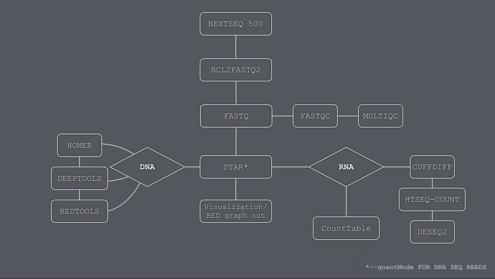

### Scripts: 

   #### DEMUX, QC and Utilities
    bcl2fastq.HPC.sh:
            Demultiplexes Illumina NextSeq 500 samples (bcl intensities to fastq).
            Performs quality control assessments using FASTQC. 
            Generates a single html report plotting all quality control metrics.

        Usage: 
            $ sbatch bcl2fastq.HPC.sh NameOfRunFolder NameOfSampleSheet NameOfPI 
    
    barcodeSplit.pl: 
        Demultiplexes fastq reads based on barcodes of interest.
    
    reHash.py:
        Rename utility.

    reveRse.py:
        Generates i5 reverse complements for Illumina NextSeq 500 samples. 
        
        Usage: 
            $ python reveRse.py < indices.txt >

   #### RNA-seq
                  
    star.align.HPC.sh: 
            Aligns PE or SE fastq samples to reference genome using star ultrafast aligner. 
            Generates bedgraph files for UCSC genome browser visualization. 
        
        Usage: 
            $ sbatch star.align.HPC.sh <SE or PE> <ORG> <ASSEMBLY> 
    
    DESeq2.R:
        Performs differential gene expression analysis of RNA-seq samples. 
        (rawCounts used are either from STAR --quantMode GeneCounts or HTSEQ outputs)
        
        Usage: 
            $ RScript DESeq2.R <Experiment.Name> <Numerator> <Denominator>
        
        For DESeq2 processCounts.sh and countMatrix.sh helper scripts are available for 
        preprocessing raw counts and creating the countMatrix.txt file, needed by the DESeq2.R script. 
        
        Usage: 
        $ processCounts.sh <1> or <2>
   
   #### CHIP-seq
      
      [MACS2](https://github.com/taoliu/MACS)
      [DeepTools](https://deeptools.readthedocs.io/en/develop/)
      [Lets go to Quora](https://www.quora.com)
      

